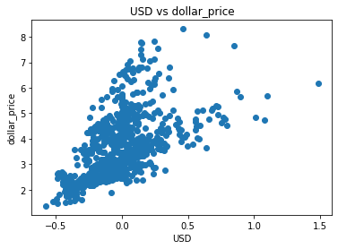

# EECS498-010 

## Homework1

name: Yijie Shi

uniqname: yijieshi

### Part 1

1. These two rows should not be removed. These two datapoints are regarded as outliers mainly because of the large exchange rate. 1 dollar equals more than 20 thousand viet-namese dong. Therefore, the local price will be very high. The local price and dollar exchange rate in this country does not invalidate dollar price data. It is because the model that we use is linear model however, dollar price = local price/ dollar_ex , it is a non-linear relationship, so the dollar price will not be invalidated.

2. local_price and dollar_ex should be removed. Because of the ‘outliers’, the learned coefficient of local price and dollar_ex will be very small, so these two factors will finally does little help for us to get the final result.

   

3. From the heated map, USD, EUR, GBP, JPY, CNY are highly correlated with each other. GDP dollar and adj_price are highly correlated with each other. Local price and dollar_ex are highly correlated with each other.

   

4. adj_price should be removed. one of GDP_dollar and adj_price should be removed, 4 of the 5 currencies should be removed. So 6 variables should be removed.

   

5. GDP_dollar residual satisfies our assumption since it’s unbiased and homoscedastic. While USD residual doesn’t since it’s heteroscedastic.

   

6. The histogram of residuals generated by histOfResiduals and the qq-plot generated by graphQQPlot are fitting well. However, the edge value are not as large as this theoretical expectation.

   

7. It meets normal distribution.

   

8. The linear regression model is good because Rsquare is close to 1

   

9. Replace the NaN with mean may affect the std value and may get a biased mean value. This may lead to a non-normal distribution.

   ## 

### Part 2

1. Yes, because stop words do not have some meaningful information. Sometimes too many stopwords in sentences may mislead the prediction.

   

2. Yes, same as stopwords, words with non-alphabetic characters do not contain much meaningful information. To many these words may affect the final result.

   

3.  TF-IDF increase the accuracy of final result. TF-IDF use the term frequency and document frequency to measure the final result comprehensively.

   

4. The review I use is 'I do not love this movie' and get a positive label. The possible reason is that the model see the word love and regard it as positive. However, it’s actually negative.

   

5. No, if negative samples take up about 2/3 of the whole dataset then the model that we get will be biased. And in final test, it will more likely to output a negative prediction.

   

6. Yes, for example, I have a sentence ‘I love this movie and I hate people who make bad reviews on this movie.’ . with same bag of words, it can also be ‘I hate this movie and I love people who make bad reviews on this movie.’. These two sentences have opposite meaning. Even the tf-idf method does not solve this problem.

